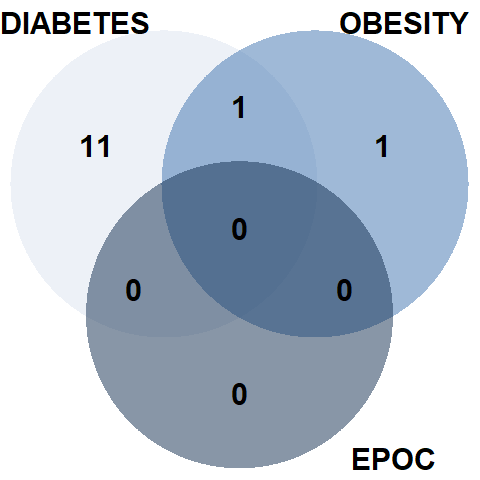

<style>
  .header-panel {
    background-color: #112D4E;
  }
  
  .tabset-pills {
  color: #112D4E;
  }
  .modebar{
        display: none !important;
  }
</style>


# Introduction
For the making of this report, it was given a dataset with data of pacients of the Hospital Austral who had suffered from heart diseases and where treated there with a surgery or an angioplasty. So, the goal of this report is trying to predict the neccesary intervention a future pacient may need.

```{r,echo=FALSE,message=FALSE}
dataset <- read.csv("dataset.csv", sep=",")
library(ggplot2)
library(plotrix)
#library(hrbrthemes)
library(dplyr)
library(tidyr)
library(plotly)
library(scales)
```

# Analysis
In this section, we are going to analyze the different factors and variables that may be used to take into account in the predictor.

## Percentage of Men and Women and age distribution for each one

Given the dataset, we thought it was imperative to start analyzing the percentage of men and women present in the registry. Even though, the difference of sex do not tend to be a factor primarily to take into account in the predictor, it could be good to show the difference and see whether we have to use it.

```{r,echo = FALSE, message = FALSE, warning = FALSE,fig.width=8, fig.height=10}
numOfMale <- length(dataset$SEXO[which(dataset$SEXO == "MASC")])
numOfFemale <- length(dataset$SEXO[which(dataset$SEXO == "FEME")])
totalNum <- numOfFemale + numOfMale
percentageOfMale <- round(numOfMale / totalNum * 100, 2)
percentageOfFemale <- round(numOfFemale / totalNum * 100, 2)
percentages <- c(percentageOfFemale,percentageOfMale)

#Pie
sex <- c("Female", "Male")
df <- data.frame(sex,percentages)
colors <- c('rgb(219, 226, 239))', 'rgb(63, 114, 175))')
fig <- plot_ly(data = df, labels = ~sex, values = ~percentages, type = 'pie',marker = list(colors = colors))
fig <- fig %>% layout(
         xaxis = list(showgrid = FALSE, zeroline = FALSE, showticklabels = FALSE),
         yaxis = list(showgrid = FALSE, zeroline = FALSE, showticklabels = FALSE))
fig

ageAverageInMen <- mean(dataset[which(dataset$SEXO == "MASC"),]$EDAD)
ageAverageInWomen <- mean(dataset[which(dataset$SEXO == "FEME"),]$EDAD)

ages <- c(dataset[which(dataset$SEXO == "MASC"),]$EDAD,dataset[which(dataset$SEXO == "FEME"),]$EDAD)
```

On the other hand, it could be relevant to check and analyze the difference of age between men and women. With this density graph, it is easy to contrast the age and each sex.

```{r,echo = FALSE, message = FALSE, warning = FALSE,fig.width = 8}
#Histograma
Age <- dataset$EDAD
Sex <- factor(dataset$SEXO, levels = c("FEME","MASC"), labels = c("Female","Male"))
df3 <- data.frame(Age,Sex)
g <- ggplot(df3, aes(x = Age, fill = Sex)) +
  geom_density(alpha = 0.8) +
  scale_fill_manual(values = c("#dbe2ef","#3f72af"),name = "Gender", labels = c("Female","Male")) +
  xlab("Age")+
  ylab(" ")+
  scale_y_continuous(labels = percent_format(accuracy = 1))+
  theme(legend.position = "top")

g <- ggplotly(g, tooltip = c("Age","Sex"))
g
```

## Age for COPD, Obesity, Diabetes and Dialysis

```{r,echo = FALSE, message = FALSE, warning = FALSE,fig.width=8}
epoc <- dataset[which(dataset$EPOC == 1),]
ageAverageWithEpoc <- mean(epoc$EDAD)
ageAverageWithEpoc <- round(ageAverageWithEpoc, 1)

obesity <- dataset[which(dataset$OBESIDAD.MORBIDA == 1),]
ageAverageWithObesity <- mean(obesity$EDAD)
ageAverageWithObesity <- round(ageAverageWithObesity, 1)

diabetes <- dataset[which(dataset$DIABETES == 1),]
ageAverageWithDiabetes <- mean(diabetes$EDAD)
ageAverageWithDiabetes <- round(ageAverageWithDiabetes, 1)

dialisis <- dataset[which(dataset$DIALISIS == 1),]
ageAverageWithDialisis <- mean(dialisis$EDAD)
ageAverageWithDialisis <- round(ageAverageWithDialisis, 1)

riskFactors <- dataset[which(dataset$EPOC == 1 | dataset$OBESIDAD.MORBIDA == 1 | dataset$DIABETES == 1 | dataset$DIALISIS == 1),]
riskFactors <- riskFactors[,c(2,17:20)]

riskFactors$EPOC <- factor(riskFactors$EPOC, levels = c(0,1), labels = c(0, "COPD"))
riskFactors$DIABETES <- factor(riskFactors$DIABETES, levels = c(0,1), labels = c(0, "DIABETES"))
riskFactors$DIALISIS <- factor(riskFactors$DIALISIS, levels = c(0,1), labels = c(0, "DIALYSIS"))
riskFactors$OBESIDAD.MORBIDA <- factor(riskFactors$OBESIDAD.MORBIDA, levels = c(0,1), labels = c(0, "MORBID OBESITY"))
riskFactors <- na_if(riskFactors,0)
riskFactors <- mutate(riskFactors, factors = paste(riskFactors$EPOC,riskFactors$DIABETES,riskFactors$DIALISIS,riskFactors$OBESIDAD.MORBIDA, sep = " & "))
riskFactors$factors <- gsub(" & NA" , "",riskFactors$factors)
riskFactors$factors <- gsub("NA &" , "",riskFactors$factors)
riskFactors$factors <- gsub(" & NA & ","", riskFactors$factors)
riskFactors <- riskFactors[which(riskFactors$factors =="COPD" | riskFactors$factors ==" DIABETES" | riskFactors$factors ==" DIALYSIS" | riskFactors$factors ==" MORBID OBESITY"),]

Age <- riskFactors$EDAD
Factor <- riskFactors$factors

df3 <- data.frame(Age,Factor)

g2 <- ggplot(df3, aes(x = Age, fill = Factor)) +
  xlab("Age")+
  ylab("")+
  geom_density(alpha = 0.7) +
  scale_fill_manual(values = c("#dbe2ef","#3f72af","#f9f7f7","#112d4e"),name = "Factors") +
  theme(legend.position = "top")+
  scale_y_continuous(labels = percent_format(accuracy = 1))

g2 <- ggplotly(g2, tooltip = c("Age", "Factor"))
g2
```

## Percentage of people who go for angioplasty, surgery or endovalvula 

```{r,echo = FALSE, message = FALSE, warning = FALSE,fig.width=8, fig.height=10}
peopleByProcedure <- dataset[which(dataset$PROCEDIMIENTO != "CIRUGIA, ENDOVALVULA"),] 
percentageByProcedure <- round(prop.table(table(peopleByProcedure$PROCEDIMIENTO), NULL)*100,2)

procedure <- c("Angioplasty", "Surgery","Endovalve")
df2 <- data.frame(procedure,percentageByProcedure)
colors <- c('rgb(17, 45, 78)','rgb(219, 226, 239))', 'rgb(63, 114, 175))')
fig <- plot_ly(data = df2, labels = ~procedure, values = ~percentageByProcedure, type = 'pie',marker = list(colors = colors))
fig <- fig %>% layout(
         xaxis = list(showgrid = FALSE, zeroline = FALSE, showticklabels = FALSE),
         yaxis = list(showgrid = FALSE, zeroline = FALSE, showticklabels = FALSE))
fig
```

# Interpretation
We interpretate the graphs with crossed variables

## Number of pacients with factors of risk {.tabset .tabset-pills .unnumbered}

### Male {- .unnumbered}
<center>
  
  </center>

### Female {- .unnumbered}
<center>
  
</center>

## Number of pacients going to each procedure by age range
```{r,echo = FALSE, message = FALSE, warning = FALSE,fig.width=8}
surgery <- dataset[which(dataset$PROCEDIMIENTO == 'CIRUGIA'),]
ageAverageInSurgery <- mean(surgery$EDAD)

angioplasty <- dataset[which(dataset$PROCEDIMIENTO == 'ANGIOPLASTIA'),]
ageAverageInAngioplasty <- mean(angioplasty$EDAD)

age2 <- c(round(ageAverageInSurgery,1), round(ageAverageInAngioplasty, 1))

#Doble barplot
a <- length(dataset$EDAD[which(dataset$EDAD < 40 & dataset$PROCEDIMIENTO == "ANGIOPLASTIA")])
b <-length(dataset$EDAD[which(dataset$EDAD < 40 & dataset$PROCEDIMIENTO == "CIRUGIA")])
c <-length(dataset$EDAD[which(dataset$EDAD >= 40  & dataset$EDAD < 50 & dataset$PROCEDIMIENTO == "ANGIOPLASTIA")])
d <-length(dataset$EDAD[which(dataset$EDAD >= 40  & dataset$EDAD < 50 & dataset$PROCEDIMIENTO == "CIRUGIA")])
e <-length(dataset$EDAD[which(dataset$EDAD >= 50  & dataset$EDAD < 60 & dataset$PROCEDIMIENTO == "ANGIOPLASTIA")])
f <-length(dataset$EDAD[which(dataset$EDAD >= 50  & dataset$EDAD < 60 & dataset$PROCEDIMIENTO == "CIRUGIA")])
g <-length(dataset$EDAD[which(dataset$EDAD >= 60  & dataset$EDAD < 70 & dataset$PROCEDIMIENTO == "ANGIOPLASTIA")])
h <-length(dataset$EDAD[which(dataset$EDAD >= 60  & dataset$EDAD < 70 & dataset$PROCEDIMIENTO == "CIRUGIA")])
i <-length(dataset$EDAD[which(dataset$EDAD >= 70  & dataset$EDAD < 80 & dataset$PROCEDIMIENTO == "ANGIOPLASTIA")])
j <-length(dataset$EDAD[which(dataset$EDAD >= 70  & dataset$EDAD < 80 & dataset$PROCEDIMIENTO == "CIRUGIA")])
k <-length(dataset$EDAD[which(dataset$EDAD >= 80 & dataset$PROCEDIMIENTO == "ANGIOPLASTIA")])
l <-length(dataset$EDAD[which(dataset$EDAD >= 80 & dataset$PROCEDIMIENTO == "CIRUGIA")])
# Grouped
Procedure <- c("Angioplasty", "Surgery")
Amount <- c(a,b,c,d,e,f,g,h,i,j,k,l)
Ages <- c(rep("<40",2), rep("40-49",2), rep("50-59",2), rep("60-69",2), rep("70-79",2), rep("80+",2))
data <- data.frame(Ages, Procedure, Amount)

p <- ggplot(data, aes(fill=Procedure, y=Amount, x=Ages)) + 
  geom_bar(position="dodge", stat="identity") +
  scale_fill_manual(values = c("#112d4e", "#3f72af")) +
  theme_bw()

p <- ggplotly(p)
p
```


## Pacients with each factor going to each procedure

```{r,echo = FALSE, message = FALSE, warning = FALSE,fig.width=8,fig.height = 6}
diabetesAndSurgery <- diabetes[which(diabetes$PROCEDIMIENTO == 'CIRUGIA'),]
diabetesAndAngioplasty <- diabetes[which(diabetes$PROCEDIMIENTO == 'ANGIOPLASTIA'),]

percentageOfSurgeryInDiabetic <- nrow(diabetesAndSurgery) / nrow(diabetes)
percentageOfAngioplastyInDiabetic <- nrow(diabetesAndAngioplasty) / nrow(diabetes)

epocAndSurgery <- epoc[which(epoc$PROCEDIMIENTO == 'CIRUGIA'),]
epocAndAngioplasty <- epoc[which(epoc$PROCEDIMIENTO == 'ANGIOPLASTIA'),]

percentageOfSurgeryInEpoc <- nrow(epocAndSurgery) / nrow(epoc)
percentageOfAngioplastyInEpoc <- nrow(epocAndAngioplasty) / nrow(epoc)

obesityAndSurgery <- obesity[which(obesity$PROCEDIMIENTO == 'CIRUGIA'),]
obesityAndAngioplasty <- obesity[which(obesity$PROCEDIMIENTO == 'ANGIOPLASTIA'),]

percentageOfSurgeryInObesity <- nrow(obesityAndSurgery) / nrow(obesity)
percentageOfAngioplastyInObesity <- nrow(obesityAndAngioplasty) / nrow(obesity)

dialisisAndSurgery <- dialisis[which(dialisis$PROCEDIMIENTO == 'CIRUGIA'),]
dialisisAndAngioplasty <- dialisis[which(dialisis$PROCEDIMIENTO == 'ANGIOPLASTIA'),]

percentageOfSurgeryInDialisis <- nrow(dialisisAndSurgery) / nrow(dialisis)
percentageOfAngioplastyInDialisis <- nrow(dialisisAndAngioplasty) / nrow(dialisis)


lenEPOCA <- length(dataset$EDAD[which(dataset$EPOC == 1 & dataset$PROCEDIMIENTO == "ANGIOPLASTIA")])
lenEPOCC <-length(dataset$EDAD[which(dataset$EPOC == 1 & dataset$PROCEDIMIENTO == "CIRUGIA")])
lenDiaA <-length(dataset$EDAD[which(dataset$DIABETES == 1 & dataset$PROCEDIMIENTO == "ANGIOPLASTIA")])
lenDiaC <-length(dataset$EDAD[which(dataset$DIABETES == 1 & dataset$PROCEDIMIENTO == "CIRUGIA")])
lenDialA <-length(dataset$EDAD[which(dataset$DIALISIS == 1 & dataset$PROCEDIMIENTO == "ANGIOPLASTIA")])
lenDialC <-length(dataset$EDAD[which(dataset$DIALISIS == 1 & dataset$PROCEDIMIENTO == "CIRUGIA")])
lenObeA <-length(dataset$EDAD[which(dataset$OBESIDAD.MORBIDA == 1 & dataset$PROCEDIMIENTO == "ANGIOPLASTIA")])
lenObeC <-length(dataset$EDAD[which(dataset$OBESIDAD.MORBIDA == 1 & dataset$PROCEDIMIENTO == "CIRUGIA")])

# Grouped
Procedure <- c("Angioplasty", "Surgery")
Amount <- c(lenDiaA, lenDiaC, lenDialA, lenDialC, lenEPOCA, lenEPOCC, lenObeA, lenObeC)
Factor <- c(rep("Diabetes",2), rep("Dialysis",2), rep("COPD",2), rep("Obesity",2))
df4 <- data.frame(Factor, Procedure, Amount)

p4 <- ggplot(df4, aes(fill=Procedure, y=Amount, x=Factor)) + 
  geom_bar(position="dodge", stat="identity") +
  scale_fill_manual(values = c("#112d4e", "#3f72af")) +
  theme_bw()

p4 <- ggplotly(p4)
p4
```

# Team

## Ignacio Fernandez Battolla

## Ignacio Chalub

## Segundo Marcaida

## Mateo Valle

## Federico Pochat


