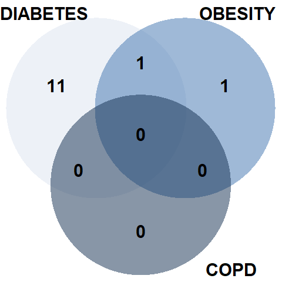

# Introduction
For the making of this report, it was given a dataset with data of pacients of the Hospital Austral who had suffered from heart diseases and where treated there with a surgery or an angioplasty. So, the goal of this report is trying to predict the neccesary intervention a future pacient may need.

```{r,echo=FALSE,message=FALSE}
dataset <- read.csv("dataset.csv", sep=",")
library(ggplot2)
library(plotrix)
#library(hrbrthemes)
library(dplyr)
library(tidyr)
```

# Analysis
In this section, we are going to analyze the different factors and variables that may be used to take into account in the predictor

## 1. Average age for COPD obesity diabetes and dialysis
```{r,echo = FALSE, message = FALSE, warning = FALSE}
epoc <- dataset[which(dataset$EPOC == 1),]
ageAverageWithEpoc <- mean(epoc$EDAD)
ageAverageWithEpoc <- round(ageAverageWithEpoc, 1)

obesity <- dataset[which(dataset$OBESIDAD.MORBIDA == 1),]
ageAverageWithObesity <- mean(obesity$EDAD)
ageAverageWithObesity <- round(ageAverageWithObesity, 1)

diabetes <- dataset[which(dataset$DIABETES == 1),]
ageAverageWithDiabetes <- mean(diabetes$EDAD)
ageAverageWithDiabetes <- round(ageAverageWithDiabetes, 1)

dialisis <- dataset[which(dataset$DIALISIS == 1),]
ageAverageWithDialisis <- mean(dialisis$EDAD)
ageAverageWithDialisis <- round(ageAverageWithDialisis, 1)

riskFactors <- dataset[which(dataset$EPOC == 1 | dataset$OBESIDAD.MORBIDA == 1 | dataset$DIABETES == 1 | dataset$DIALISIS == 1),]
riskFactors <- riskFactors[,c(2,17:20)]

riskFactors$EPOC <- factor(riskFactors$EPOC, levels = c(0,1), labels = c(0, "EPOC"))
riskFactors$DIABETES <- factor(riskFactors$DIABETES, levels = c(0,1), labels = c(0, "DIABETES"))
riskFactors$DIALISIS <- factor(riskFactors$DIALISIS, levels = c(0,1), labels = c(0, "DIALISIS"))
riskFactors$OBESIDAD.MORBIDA <- factor(riskFactors$OBESIDAD.MORBIDA, levels = c(0,1), labels = c(0, "MORBID OBESITY"))
riskFactors <- na_if(riskFactors,0)
riskFactors <- mutate(riskFactors, factors = paste(riskFactors$EPOC,riskFactors$DIABETES,riskFactors$DIALISIS,riskFactors$OBESIDAD.MORBIDA, sep = " & "))
riskFactors$factors <- gsub(" & NA" , "",riskFactors$factors)
riskFactors$factors <- gsub("NA &" , "",riskFactors$factors)
riskFactors$factors <- gsub(" & NA & ","", riskFactors$factors)
riskFactors <- riskFactors[which(riskFactors$factors != "EPOC & DIABETES"),]

ggplot(riskFactors, aes(x = EDAD, fill = riskFactors$factors)) +
  geom_density(alpha = 0.4) +
  scale_fill_discrete(name = "Factors") +
  theme(legend.position = "top")
```

## 2. Percentage of Men and Women and age distribution for each one
```{r,echo = FALSE, message = FALSE, warning = FALSE}
numOfMale <- length(dataset$SEXO[which(dataset$SEXO == "MASC")])
numOfFemale <- length(dataset$SEXO[which(dataset$SEXO == "FEME")])
totalNum <- numOfFemale + numOfMale
percentageOfMale <- round(numOfMale / totalNum * 100, 2)
percentageOfFemale <- round(numOfFemale / totalNum * 100, 2)
percentages <- c(percentageOfFemale,percentageOfMale)

#Pie
pie3D(percentages,main = "Men and women percentage", labels = c(paste("Women", percentageOfFemale,"%"), paste("Men", percentageOfMale,"%")), theta = 1, explode = 0.00)


ageAverageInMen <- mean(dataset[which(dataset$SEXO == "MASC"),]$EDAD)
ageAverageInWomen <- mean(dataset[which(dataset$SEXO == "FEME"),]$EDAD)

ages <- c(dataset[which(dataset$SEXO == "MASC"),]$EDAD,dataset[which(dataset$SEXO == "FEME"),]$EDAD)

#Histograma
ggplot(dataset, aes(x = EDAD, fill = SEXO)) +
  geom_density(alpha = 0.4) +
  scale_fill_discrete(name = "Gender", labels = c("Female","Male")) +
  theme(legend.position = "top")+
  geom_vline(data=dataset, aes(xintercept=ageAverageInMen, color = "Men"),
               linetype="dashed")+
  geom_vline(data=dataset, aes(xintercept=ageAverageInWomen, color = "Women"),
             linetype="dashed")

```

## 3. Percentage of people who go for angioplasty, surgery or endovalvula 
```{r,echo = FALSE, message = FALSE, warning = FALSE}
peopleByProcedure <- dataset[which(dataset$PROCEDIMIENTO != "CIRUGIA, ENDOVALVULA"),] 
percentageByProcedure <- prop.table(table(peopleByProcedure$PROCEDIMIENTO), NULL)*100
percentageByProcedureArray <- c(percentageByProcedure[1],percentageByProcedure[2],percentageByProcedure[3])
pie3D(percentageByProcedureArray, main = "Percentage by procedure",
      labels = c(paste("Angioplasty", round(percentageByProcedure[1],digits=2),"%"), paste("Surgery", round(percentageByProcedure[2],digits=2),"%"), paste("Endovalve", round(percentageByProcedure[3],digits=2),"%")),
      theta = 1,
      explode = 0.00)

```

## 4.
```{r,echo = FALSE, message = FALSE, warning = FALSE}

```

## 5. {.tabset .unnumbered}

### Male {- .unnumbered}


### Female {- .unnumbered}

```{r,echo = FALSE, message = FALSE, warning = FALSE}

```

## 6.
```{r,echo = FALSE, message = FALSE, warning = FALSE}
surgery <- dataset[which(dataset$PROCEDIMIENTO == 'CIRUGIA'),]
ageAverageInSurgery <- mean(surgery$EDAD)

angioplasty <- dataset[which(dataset$PROCEDIMIENTO == 'ANGIOPLASTIA'),]
ageAverageInAngioplasty <- mean(angioplasty$EDAD)

age2 <- c(round(ageAverageInSurgery,1), round(ageAverageInAngioplasty, 1))

#Doble barplot
a <- length(dataset$EDAD[which(dataset$EDAD < 40 & dataset$PROCEDIMIENTO == "ANGIOPLASTIA")])
b <-length(dataset$EDAD[which(dataset$EDAD < 40 & dataset$PROCEDIMIENTO == "CIRUGIA")])
c <-length(dataset$EDAD[which(dataset$EDAD >= 40  & dataset$EDAD < 50 & dataset$PROCEDIMIENTO == "ANGIOPLASTIA")])
d <-length(dataset$EDAD[which(dataset$EDAD >= 40  & dataset$EDAD < 50 & dataset$PROCEDIMIENTO == "CIRUGIA")])
e <-length(dataset$EDAD[which(dataset$EDAD >= 50  & dataset$EDAD < 60 & dataset$PROCEDIMIENTO == "ANGIOPLASTIA")])
f <-length(dataset$EDAD[which(dataset$EDAD >= 50  & dataset$EDAD < 60 & dataset$PROCEDIMIENTO == "CIRUGIA")])
g <-length(dataset$EDAD[which(dataset$EDAD >= 60  & dataset$EDAD < 70 & dataset$PROCEDIMIENTO == "ANGIOPLASTIA")])
h <-length(dataset$EDAD[which(dataset$EDAD >= 60  & dataset$EDAD < 70 & dataset$PROCEDIMIENTO == "CIRUGIA")])
i <-length(dataset$EDAD[which(dataset$EDAD >= 70  & dataset$EDAD < 80 & dataset$PROCEDIMIENTO == "ANGIOPLASTIA")])
j <-length(dataset$EDAD[which(dataset$EDAD >= 70  & dataset$EDAD < 80 & dataset$PROCEDIMIENTO == "CIRUGIA")])
k <-length(dataset$EDAD[which(dataset$EDAD >= 80 & dataset$PROCEDIMIENTO == "ANGIOPLASTIA")])
l <-length(dataset$EDAD[which(dataset$EDAD >= 80 & dataset$PROCEDIMIENTO == "CIRUGIA")])
# Grouped
PROCEDURES <- c("ANGIOPLASTY", "SURGERY")
AMOUNT <- c(a,b,c,d,e,f,g,h,i,j,k,l)
AGES <- c(rep("<40",2), rep("40-49",2), rep("50-59",2), rep("60-69",2), rep("70-79",2), rep("80+",2))
data <- data.frame(AGES, PROCEDURES, AMOUNT)

ggplot(data, aes(fill=PROCEDURES, y=AMOUNT, x=AGES)) + 
  geom_bar(position="dodge", stat="identity") +
  scale_fill_brewer(palette = "BuGn", type = "div", direction = -1) +
  theme_bw()

```

## 7. Percentage of risk and no risk per procedure (without endovalvula)
```{r,echo = FALSE, message = FALSE, warning = FALSE}
diabetesAndSurgery <- diabetes[which(diabetes$PROCEDIMIENTO == 'CIRUGIA'),]
diabetesAndAngioplasty <- diabetes[which(diabetes$PROCEDIMIENTO == 'ANGIOPLASTIA'),]

percentageOfSurgeryInDiabetic <- nrow(diabetesAndSurgery) / nrow(diabetes)
percentageOfAngioplastyInDiabetic <- nrow(diabetesAndAngioplasty) / nrow(diabetes)

epocAndSurgery <- epoc[which(epoc$PROCEDIMIENTO == 'CIRUGIA'),]
epocAndAngioplasty <- epoc[which(epoc$PROCEDIMIENTO == 'ANGIOPLASTIA'),]

percentageOfSurgeryInEpoc <- nrow(epocAndSurgery) / nrow(epoc)
percentageOfAngioplastyInEpoc <- nrow(epocAndAngioplasty) / nrow(epoc)

obesityAndSurgery <- obesity[which(obesity$PROCEDIMIENTO == 'CIRUGIA'),]
obesityAndAngioplasty <- obesity[which(obesity$PROCEDIMIENTO == 'ANGIOPLASTIA'),]

percentageOfSurgeryInObesity <- nrow(obesityAndSurgery) / nrow(obesity)
percentageOfAngioplastyInObesity <- nrow(obesityAndAngioplasty) / nrow(obesity)

dialisisAndSurgery <- dialisis[which(dialisis$PROCEDIMIENTO == 'CIRUGIA'),]
dialisisAndAngioplasty <- dialisis[which(dialisis$PROCEDIMIENTO == 'ANGIOPLASTIA'),]

percentageOfSurgeryInDialisis <- nrow(dialisisAndSurgery) / nrow(dialisis)
percentageOfAngioplastyInDialisis <- nrow(dialisisAndAngioplasty) / nrow(dialisis)


diabetes7 <- c(percentageOfAngioplastyInDiabetic*100,percentageOfSurgeryInDiabetic*100)
dialisis7 <- c(percentageOfAngioplastyInDialisis*100,percentageOfSurgeryInDialisis*100)
epoc7 <- c(percentageOfAngioplastyInEpoc*100,percentageOfSurgeryInEpoc*100)
obesity7<-c(percentageOfAngioplastyInObesity*100,percentageOfSurgeryInObesity*100)

diabetesBar <- barplot(diabetes7,ylab="Percentage of patients with diabetes who go to each procedure" , names=c("Angioplasty","Surgery"),col = c(rgb(0.3,0.1,0.4,0.6) , rgb(0.3,0.5,0.4,0.6)),ylim=c(0,100))
text(diabetesBar, labels=paste("%", c(round(diabetes7,2))), y=diabetes7+5)

dialisisBar <- barplot(dialisis7,ylab="Percentage of patients with dialisis who go to each procedure" , names=c("Angioplasty","Surgery"),col = c(rgb(0.3,0.1,0.4,0.6) , rgb(0.3,0.5,0.4,0.6)),ylim=c(0,100))
text(dialisisBar, labels=paste("%", c(round(dialisis7,2))), y=dialisis7+5)

epocBar <- barplot(epoc7,ylab="Percentage of patients with epoc who go to each procedure" , names=c("Angioplasty","Surgery"),col = c(rgb(0.3,0.1,0.4,0.6) , rgb(0.3,0.5,0.4,0.6)),ylim=c(0,100))
text(epocBar, labels=paste("%", c(round(epoc7,2))), y=epoc7+5)

obesityBar <- barplot(obesity7,ylab="Percentage of patients with morbid obesity who go to each procedure" , names=c("Angioplasty","Surgery"),col = c(rgb(0.3,0.1,0.4,0.6) , rgb(0.3,0.5,0.4,0.6)),ylim=c(0,100))
text(obesityBar, labels=paste("%", c(round(obesity7,2))), y=obesity7+5)


```

## 8.
```{r,echo = FALSE, message = FALSE, warning = FALSE}

```

# Interpretation
We interpretate the graphs and put more y data ...